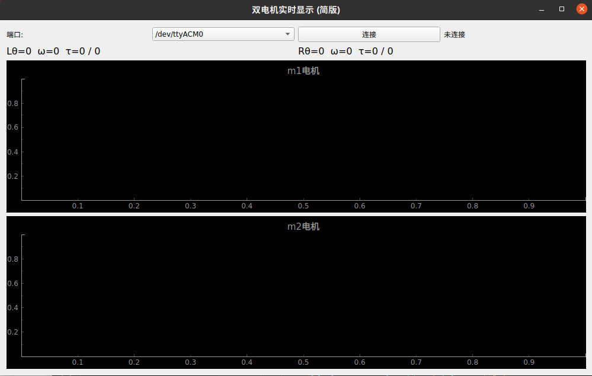

# Omni Motor Test with Teensy and GUI

This repository contains a simple example code and GUI for testing an **Omni motor** using a **Teensy** microcontroller.



---


## 📦 Files

* **`test_two_motor.zip`** — Example code for Teensy to test Omni motors.
* **`image.png`** — GUI demonstration image.

## 📚 手册说明 / Manual Overview

项目中共包含三个主要的手册，内容较多略显复杂。为帮助快速上手，我们建议重点阅读以下两个手册：

There are **three main manuals** included in this project. The documentation is somewhat complex, so to get started efficiently, we recommend focusing on the following **two key manuals**:

### ✅ 重点阅读 / Recommended to Read

1. **守护兽驱动用户手册.docx**
   **(Guardian BeastDriver User Manual)**
   📘 **系统级手册，介绍整个系统的架构与使用方法。**
   📘 *This is a system-level manual that explains the overall architecture and usage of the system.*

2. **守护兽驱动协议手册.docx**
   **(Guardian BeastDriver Protocol Manual)**
   📗 **讲解如何将 CAN 协议转换为 C++ SDK，实现手动开发。**
   📗 *Explains how to translate the CAN protocol into a C++ SDK manually.*

---

### 🚫 可忽略 / Not Required to Read

3. **守护兽驱动SDK用户手册.docx**
   **(Guardian Beast DriverSDKUser Manual)**
   📄 **这是官方提供的完整 SDK 文档，但我们项目中不需要使用。**
   📄 *This is the official SDK documentation, but it’s not required for our use case.*

---

## 📝 中英文手册对应关系 / Manual Language Mapping

| 中文手册文件名           | English Manual Filename                   | 内容说明            | Description                   |
| ----------------- | ----------------------------------------- | --------------- | ----------------------------- |
| 守护兽驱动用户手册.docx    | Guardian BeastDriver User Manual.docx     | 系统级别使用说明        | System-level user manual      |
| 守护兽驱动协议手册.docx    | Guardian BeastDriver Protocol Manual.docx | 协议转 SDK 开发指南    | Protocol-to-SDK guide         |
| 守护兽驱动SDK用户手册.docx | Guardian Beast DriverSDKUser Manual.docx  | 官方 SDK 说明（不需要看） | Official SDK doc (not needed) |


---

## ⚙️ Setup Instructions

Every time you set up an Omni motor, you will need to **initialize** the Teensy and configure your motor.
For a detailed initialization tutorial, please refer to:
[**Full Guide**](https://cyberbeast.feishu.cn/docx/N3SMd4QyRobzHkx3wP3cT1qXnpf)

---

### 1. Connect to ODrive

Open **Odrivetool** and connect your motor.

---

### 2. Set Motor ID and Baud Rate

```python
odrv0.axis0.config.can.node_id = 3
odrv0.can.config.baud_rate = 1000000  # Change from default 500000 to 1000000
odrv0.save_configuration()
```

---

### 3. Calibrate the Motor

```python
odrv0.axis0.requested_state = AXIS_STATE_MOTOR_CALIBRATION
dump_errors(odrv0)

odrv0.axis0.requested_state = AXIS_STATE_ENCODER_OFFSET_CALIBRATION
dump_errors(odrv0)

odrv0.axis0.motor.config.pre_calibrated = 1
odrv0.axis0.encoder.config.pre_calibrated = 1
odrv0.save_configuration()
```

---

### 4. Open Corresponding Port

```python
odrv0.axis0.config.can.encoder_rate_ms = 10
odrv0.axis0.config.can.iq_rate_ms = 10
odrv0.save_configuration()
```

---

### 5. Check Torque Constant

```python
odrv0.axis0.motor.config.torque_constant
```

---

✅ **Done!** You have completed all setup steps.
