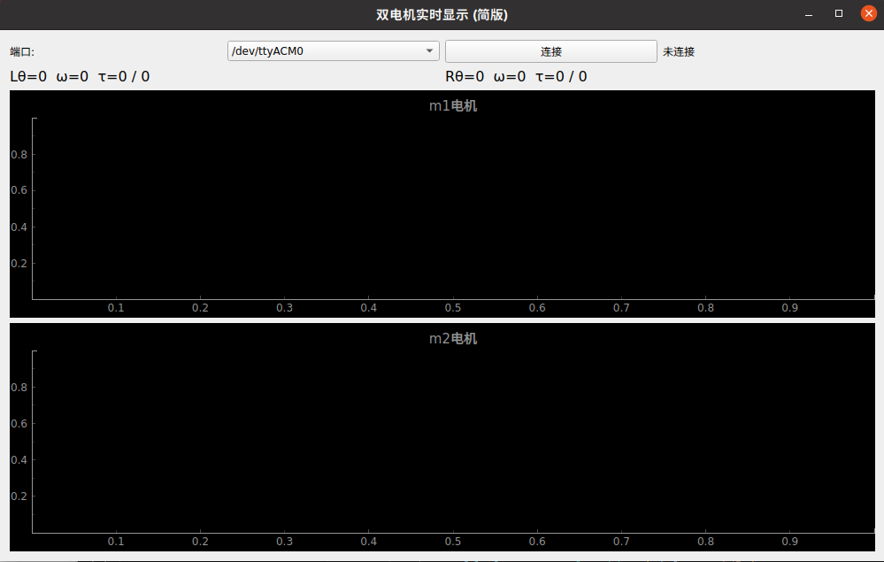

odrv0.axis0.controller.config.torque_ramp_rate = 20.0

odrv0.axis0.config.can.motor_error_rate_ms = 0

odrv0.save_configuration()


odrv0.axis0.requested_state = AXIS_STATE_IDLE

odrv0.axis0.config.enable_watchdog = True

odrv0.axis0.config.watchdog_timeout = 0.3   # 先用 0.3s，后续可调 0.2~0.5

odrv0.save_configuration()

odrv0.reboot()

odrv0.axis0.requested_state = AXIS_STATE_CLOSED_LOOP_CONTROL

odrv0.axis0.controller.input_torque = 0.2

# 不再发送任何命令，等待 >0.3s

time.sleep(0.6)

print(hex(int(odrv0.axis0.error)))   # 预期出现 watchdog 相关错误位


--------------------
# 白的是0.0644，蓝的是0.0568.如果分不清楚，就白的喝白的成套

odrv0.axis0.motor.config.gear_ratio

odrv0.axis0.motor.config.torque_constant 

odrv0.axis0.config.can.motor_error_rate_ms = 10

odrv0.axis0.motor.fet_thermistor.config.temp_limit_upper = 9999999

odrv0.axis0.motor.motor_thermistor.config.temp_limit_upper = 9999999

odrv0.axis0.motor.config.current_lim = 80

odrv0.config.dc_max_positive_current = 200

odrv0.axis0.controller.config.vel_limit = 9999999

odrv0.axis0.controller.config.enable_vel_limit = False

odrv0.axis0.controller.config.enable_torque_mode_vel_limit = False

odrv0.axis0.motor.fet_thermistor.config.enabled = False 

odrv0.axis0.motor.motor_thermistor.config.enabled = False 

odrv0.axis0.motor.config.current_lim  = 9999999

odrv0.axis0.controller.config.torque_ramp_rate  = 9999999

odrv0.config.dc_max_negative_current = -20   # 你现在是 

odrv0.config.dc_bus_overvoltage_trip_level = 40             
                                                              
odrv0.config.dc_bus_undervoltage_trip_level = 10            
                                                              
odrv0.config.brake_resistance = 50  # 刹车电阻阻值
odrv0.config.enable_brake_resistor = True                 
                                                              
  odrv0.save_configuration()                                  
                                
--------------------------------             
params = [                                                                    
      ("gear_ratio", odrv0.axis0.motor.config.gear_ratio),                      
      ("torque_constant", odrv0.axis0.motor.config.torque_constant),            
      ("current_lim", odrv0.axis0.motor.config.current_lim),                    
      ("vel_limit", odrv0.axis0.controller.config.vel_limit),                   
      ("enable_vel_limit", odrv0.axis0.controller.config.enable_vel_limit),
      ("enable_torque_mode_vel_limit",                                          
  odrv0.axis0.controller.config.enable_torque_mode_vel_limit),                  
      ("torque_ramp_rate", odrv0.axis0.controller.config.torque_ramp_rate),     
      ("dc_max_positive_current", odrv0.config.dc_max_positive_current),        
      ("dc_max_negative_current", odrv0.config.dc_max_negative_current),
      ("dc_bus_overvoltage_trip_level",                                         
  odrv0.config.dc_bus_overvoltage_trip_level),                                  
      ("dc_bus_undervoltage_trip_level",
  odrv0.config.dc_bus_undervoltage_trip_level),                                 
      ("enable_brake_resistor", odrv0.config.enable_brake_resistor),
      ("brake_resistance", odrv0.config.brake_resistance),                      
      ("fet_therm_enabled", odrv0.axis0.motor.fet_thermistor.config.enabled),
      ("fet_therm_limit",                                                       
  odrv0.axis0.motor.fet_thermistor.config.temp_limit_upper),                    
      ("motor_therm_enabled",                                                   
  odrv0.axis0.motor.motor_thermistor.config.enabled),                           
      ("motor_therm_limit",                                 
  odrv0.axis0.motor.motor_thermistor.config.temp_limit_upper),                  
  ]
  for name, val in params: print(f"{name}: {val}")    

  
# Omni Motor Test with Teensy and GUI

This repository contains a simple example code and GUI for testing an **Omni motor** using a **Teensy** microcontroller.



---


## 📦 Files

* **`test_two_motor.zip`** — Example code for Teensy to test Omni motors.
* **`image.png`** — GUI demonstration image.

## 📚 手册说明 / Manual Overview

项目中共包含三个主要的手册，内容较多略显复杂。为帮助快速上手，我们建议重点阅读以下两个手册：

There are **three main manuals** included in this project. The documentation is somewhat complex, so to get started efficiently, we recommend focusing on the following **two key manuals**:

### ✅ 重点阅读 / Recommended to Read

1. **守护兽驱动用户手册.docx**
   **(Guardian BeastDriver User Manual)**
   📘 **系统级手册，介绍整个系统的架构与使用方法。**
   📘 *This is a system-level manual that explains the overall architecture and usage of the system.*

2. **守护兽驱动协议手册.docx**
   **(Guardian BeastDriver Protocol Manual)**
   📗 **讲解如何将 CAN 协议转换为 C++ SDK，实现手动开发。**
   📗 *Explains how to translate the CAN protocol into a C++ SDK manually.*

---

### 🚫 可忽略 / Not Required to Read

3. **守护兽驱动SDK用户手册.docx**
   **(Guardian Beast DriverSDKUser Manual)**
   📄 **这是官方提供的完整 SDK 文档，但我们项目中不需要使用。**
   📄 *This is the official SDK documentation, but it’s not required for our use case.*

---

## 📝 中英文手册对应关系 / Manual Language Mapping

| 中文手册文件名           | English Manual Filename                   | 内容说明            | Description                   |
| ----------------- | ----------------------------------------- | --------------- | ----------------------------- |
| 守护兽驱动用户手册.docx    | Guardian BeastDriver User Manual.docx     | 系统级别使用说明        | System-level user manual      |
| 守护兽驱动协议手册.docx    | Guardian BeastDriver Protocol Manual.docx | 协议转 SDK 开发指南    | Protocol-to-SDK guide         |
| 守护兽驱动SDK用户手册.docx | Guardian Beast DriverSDKUser Manual.docx  | 官方 SDK 说明（不需要看） | Official SDK doc (not needed) |


---

## ⚙️ Setup Instructions

Every time you set up an Omni motor, you will need to **initialize** the Teensy and configure your motor.
For a detailed initialization tutorial, please refer to:
[**Full Guide**](https://cyberbeast.feishu.cn/docx/N3SMd4QyRobzHkx3wP3cT1qXnpf)

---

### 1. Connect to ODrive

Open **Odrivetool** and connect your motor.

---

### 2. Set Motor ID and Baud Rate

```python
odrv0.axis0.config.can.node_id = 3
odrv0.can.config.baud_rate = 1000000  # Change from default 500000 to 1000000
odrv0.save_configuration()
```

---

### 3. Calibrate the Motor

```python
odrv0.axis0.requested_state = AXIS_STATE_MOTOR_CALIBRATION
dump_errors(odrv0)

odrv0.axis0.requested_state = AXIS_STATE_ENCODER_OFFSET_CALIBRATION
dump_errors(odrv0)

odrv0.axis0.motor.config.pre_calibrated = 1
odrv0.axis0.encoder.config.pre_calibrated = 1
odrv0.save_configuration()
```

---

### 4. Open Corresponding Port

```python
odrv0.axis0.config.can.encoder_rate_ms = 10
odrv0.axis0.config.can.iq_rate_ms = 10
odrv0.save_configuration()
```

---

### 5. Check Torque Constant

```python
odrv0.axis0.motor.config.torque_constant
should = 0.06?
```

---

✅ **Done!** You have completed all setup steps.

下面是一些测试方式
首先需要将控制模式更改为力矩模式 odrv0.axis0.controller.config.control_mode = 1
运行电机odrv0.axis0.requested_state = 8
力矩控制的单位是 Nm（转子侧），而驱动器固件中电流单位是 A，所以还需要设置力矩常数，以让驱动器能够将 Nm 转换为电流，从而按需求驱动电机输出力矩。 # 力矩常数大约等于 odrv0.axis0.motor.config.torque_constant = 8.23/12.3

首先需要将控制模式更改为力矩模式 odrv0.axis0.controller.config.control_mode = 直接力矩控制（Toruqe Control） 这是最简单的力矩（电流）控制模式，电机会以全力到达目标力矩，电机可能会很容易触发报警，所以我们并不推荐使用，使能如下： odrv0.axis0.controller.config.input_mode = 1
此时电机已经进入工作状态，需要输入目标，请注意输入单位为转子侧的牛米
odrv0.axis0.controller.input_torque = 1.2 #单位Nm
